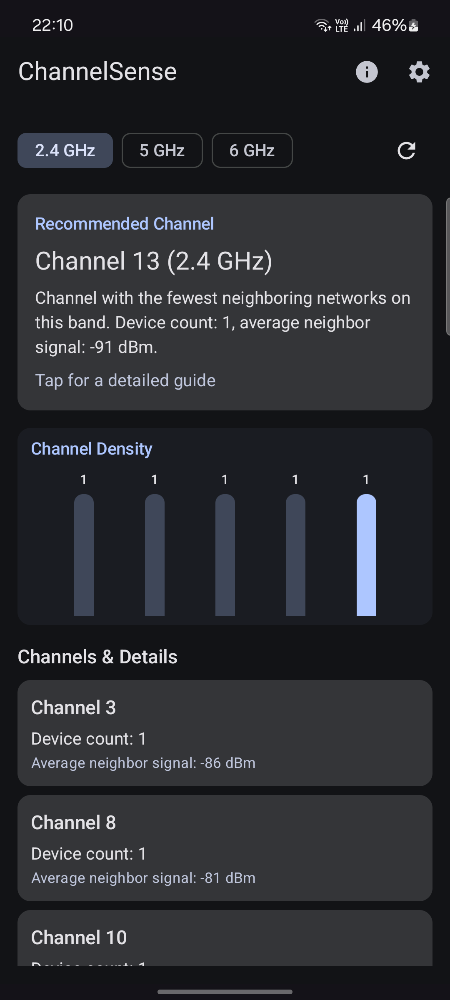
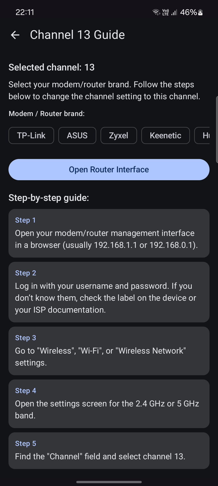
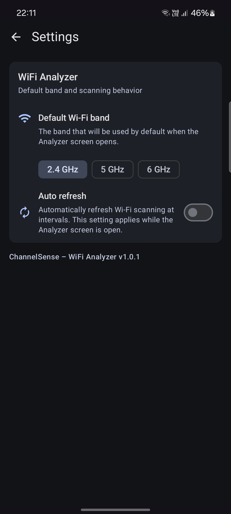

# ChannelSense – WiFi Analyzer & Guide

> **Analyze WiFi channels, discover crowded channels and find the most optimal one for your network.**  
> ChannelSense helps you check 2.4 GHz and 5 GHz channel usage around you and provides guidance on how to change the channel in your router settings.

 

## 🚀 Features

✔ Scan nearby WiFi networks  
✔ Visual channel usage graph  
✔ Recommended channel based on real usage  
✔ Shows devices per channel and signal strength  
✔ Works with both 2.4 GHz and 5 GHz  
✔ Tappable channels → Go to detailed guide  
✔ Router brand selection (TP-Link, ASUS, Zyxel, Keenetic, Huawei etc.)  
✔ Step-by-step instructions for changing router channel  
✔ Open router admin page (gateway IP)  
✔ Material 3 + Material You design  
✔ 100% offline  
✔ Open source

 

---

## 🧠 Why ChannelSense?

Most home routers automatically select a WiFi channel — but **they often choose crowded ones**, causing:

- slow connection
- high ping
- low throughput
- random connection drops

ChannelSense lets you easily check real-time channel usage and **suggests the least crowded channel**.

 

---

## 🔒 Privacy & Permissions

Android considers WiFi scanning a location-related permission, so we MUST request that permission.

However:

> **We do not collect, store or send your location or WiFi information anywhere.**  
Everything happens locally on your device.  
No server. No analytics. No tracking.

 

**Permissions used**:

| Permission | Why |
|-----------|-----|
| NEARBY_WIFI_DEVICES (Android 13+) | WiFi scan |
| ACCESS_FINE_LOCATION (Android ≤ 12) | Required by Android for WiFi scans |
| ACCESS_WIFI_STATE | Check WiFi state |
| CHANGE_WIFI_STATE | Start scan |

 

---

## 📊 How channel recommendation works

1. Scan all nearby WiFi networks
2. Group by channel
3. Count devices per channel
4. Calculate average RSSI
5. Recommend channel with:
    - lowest number of devices
    - lowest signal overlap

 

---

## 📡 Does this app change router settings?

No — Android **cannot** control router configuration.

ChannelSense:
- suggests best channel,
- shows how to change manually,
- opens your router admin page (gateway IP),
- shows brand-specific instructions.

 

---

## 📱 Screenshots

 
 

 

---

## 🧩 Built with

- Kotlin
- Jetpack Compose
- Material 3
- Navigation Compose
- Android ViewModel
- WifiManager API

 

---

## ⚙️ Tech structure (simplified)

feature/analyzer
feature/guide
wifi/
model/
scanner/
permissions/
ui/components
ui/navigation
ui/theme
util/

 

---

## 🛠 Roadmap

- 📌 Auto-refresh scanning
- 📌 Dark mode optimizations
- 📌 Channel overlap view
- 📌 Country-based channel availability
- 📌 Custom chart animations
- 📌 Multi-language UI
- 📌 App icon + branding

 

---

## 🤝 Contributions

Pull requests are welcome!  
Improvements, new router guides and translations are especially appreciated 🙌

 

---

## 👤 Author

**Mahmut Alperen Ünal**  
GitHub: https://github.com/mahmutalperenunal

Feel free to reach out!

 

---

## 📎 License

This project is licensed under the MIT License.  
See `LICENSE` file for details.