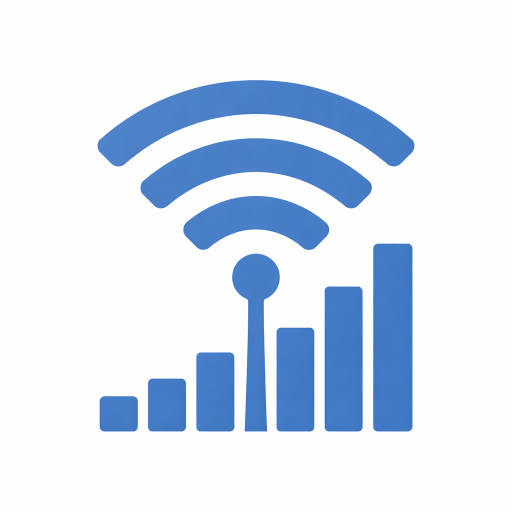
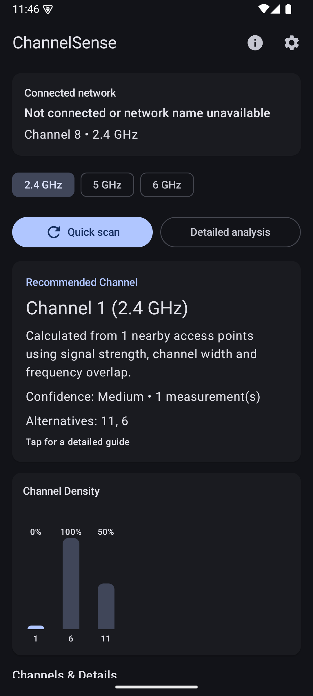
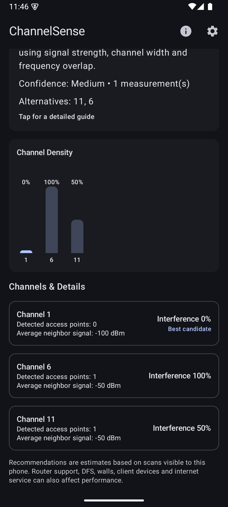
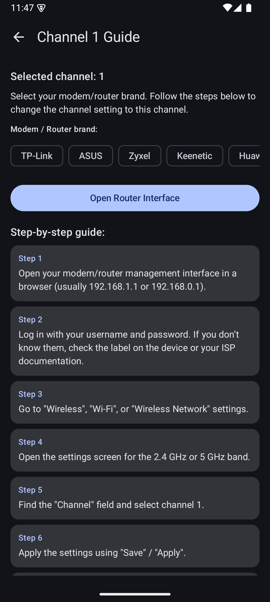

<div align="center">



# ChannelSense

**Privacy-first Wi-Fi Channel Analyzer for Android**

Find the best Wi-Fi channel using **real interference analysis** instead of simply counting nearby networks.

[]([https://play.google.com/store/apps/details?id=com.alpwarestudio.wakeon](https://play.google.com/store/apps/details?id=com.mahmutalperenunal.channelsense&pli=1))
[]()
[]()
[]()
[](LICENSE)

</div>

---

## Overview

ChannelSense is a modern Android application that helps users choose the most suitable Wi-Fi channel for their router.

Unlike many Wi-Fi analyzer applications that only count nearby access points, ChannelSense evaluates multiple radio characteristics to estimate actual channel interference.

The recommendation engine considers:

- Signal strength (RSSI)
- Channel width
- Frequency overlap
- Band characteristics
- Current connected network
- Confidence score

Everything runs **entirely on-device**.

No cloud.

No analytics.

No tracking.

No advertisements.

---

## Why ChannelSense?

Most Wi-Fi analyzer applications rank channels by simply counting nearby networks.

In real environments this is rarely accurate.

Two networks on the same channel do not always create the same amount of interference.

ChannelSense estimates channel quality using a weighted interference model that includes:

- RSSI weighting
- Channel width
- Frequency overlap
- Adjacent channel influence
- Band-specific behavior

The result is a recommendation that better reflects real wireless conditions.

---

# Features

## Wi-Fi Analysis

- 2.4 GHz analysis
- 5 GHz analysis
- 6 GHz analysis
- Current connected channel detection
- Nearby Access Point discovery
- RSSI visualization
- Channel utilization graph
- Alternative channel recommendations
- Confidence indicator
- Explainable Wi-Fi connection quality score
- Phone-to-router receive/transmit link speeds and Wi-Fi standard

### Connection quality

The connected-network card combines signal strength (45%), negotiated phone-to-router link speed (30%), and an absolute estimate derived from current-channel RF interference (25%) into a local 0–100 quality score. It reports the dominant limiting factor and keeps link speed clearly separate from internet throughput. Missing device telemetry receives a neutral value rather than incorrectly lowering the score. No test files are downloaded and no network measurement is sent off-device.

---

## Analysis Modes

### Quick Analysis

Single scan for instant recommendations.

Ideal for everyday users.

### Detailed Analysis

Performs multiple measurements to reduce temporary fluctuations and provide more stable recommendations.

---

## Recommendation Engine

ChannelSense recommends channels using:

- RSSI weighted scoring
- Frequency overlap calculations
- Channel width impact
- Adjacent channel interference
- Confidence estimation

This produces significantly more useful recommendations than network-count based approaches.

---

## Router Assistance

ChannelSense also helps users apply the recommendation.

Features include:

- Router setup guides
- Common router brands
- Gateway detection
- Open router admin page directly
- Channel configuration instructions

---

## Personalization

- System, light, and dark theme modes
- Material You dynamic colors on Android 12 and newer
- Branded light and dark color fallback on older Android versions
- In-app language selection for Turkish, English, or the system default
- Persistent preferences that apply immediately

---

## Optional Background Monitoring

- Disabled by default to protect battery life
- User-selectable monitoring and notification intervals
- Local congestion checks with network, channel, density, and recommendation details
- Android notification and background-work controls respected

---

## Privacy First

Privacy is a core design principle.

ChannelSense:

- does not require an account
- does not upload Wi-Fi information
- does not collect analytics
- does not use advertising SDKs
- does not communicate with any backend server

All analysis is performed locally on the device.

For more information see:

- **PRIVACY.md**

---

# Screenshots

| Home | Analysis | Recommendation |
|------|-----------|----------------|
|  |  |  |

---

# Architecture

The project follows a clean and modular architecture.

```
app
│
├── domain
│   └── Recommendation Engine
│
├── feature
│   ├── Analyzer
│   ├── Settings
│   └── Router Guide
│
├── wifi
│   ├── Scanner
│   ├── Connection
│   └── Permissions
│
├── ui
│
└── util
```

Core recommendation logic is independent from Android APIs, making it easy to test and maintain.

---

# Tech Stack

- Kotlin
- Jetpack Compose
- Material 3
- Navigation Compose
- ViewModel
- DataStore
- Android Wi-Fi APIs
- Android 9+
- Gradle Kotlin DSL

---

# Project Structure

```
domain/
    ChannelRecommendationEngine

feature/
    analyzer/
    settings/
    guide/

wifi/
    scanner/
    permissions/
    connection/

ui/
theme/
navigation/

util/
```

---

# Requirements

- Android 9 (API 28) or newer
- Wi-Fi enabled
- Location Services enabled (required by Android)
- Nearby Wi-Fi permission
- Location permission (depending on Android version)

---

# Building

Clone the repository.

```bash
git clone https://github.com/mahmutaunal/ChannelSense.git
```

Open with Android Studio.

Build:

```bash
./gradlew assembleDebug
```

Run tests:

```bash
./gradlew testDebugUnitTest
```

Generate Release:

```bash
./gradlew assembleRelease
```

---

# Important Limitations

Android applies several restrictions to Wi-Fi scanning.

Because of platform limitations:

- scan results may be cached
- scan frequency may be throttled
- hidden networks may not appear
- DFS channels behave differently
- mesh systems may affect results

Recommendations are estimates based on the access points visible to the device at scan time.

---

# Contributing

Contributions are welcome.

If you would like to:

- fix bugs
- improve the recommendation engine
- optimize performance
- improve translations
- enhance the UI

please open an Issue or submit a Pull Request.

---

# Roadmap

Future ideas include:

- Tablet optimization
- Foldable support
- Better visualization
- Export scan results
- Historical comparison
- More router setup guides
- Improved DFS awareness

---

# License

Licensed under the Apache License 2.0.

See the **LICENSE** file for details.

---

# Author

**Mahmut Alperen Ünal**

GitHub

https://github.com/mahmutaunal

---

## Support

If you find this project useful:

- ⭐ Star the repository
- 🐞 Report bugs
- 💡 Suggest new features
- 🤝 Contribute to the project

---

Made with ❤️ using Kotlin and Jetpack Compose.

## Google Play integrations

ChannelSense uses the dedicated Google Play Core libraries for in-app reviews and in-app updates. The Play-specific implementation lives under `play/` so the UI and application features remain decoupled from Google Play APIs.

> In-app review and update flows must be tested with a Google Play-installed build. For update testing, use Play Console Internal App Sharing or an internal testing track with a higher `versionCode`.

The app checks for updates once at startup and also offers a manual action in Settings. Normal releases use a flexible background download. Releases with Play priority 4 or higher, or releases available for at least seven days, use an immediate update when Google Play permits it. Installation remains fully managed by Google Play; ChannelSense never downloads APK files from a project-controlled server.

### Optional congestion monitoring

Background congestion monitoring is disabled by default. Users can opt in from Settings and choose a maximum alert frequency of 30 minutes, 1 hour, 3 hours, or 6 hours. WorkManager performs inexact, battery-aware checks and skips work while the battery is low. A notification is shown only when the connected channel reaches at least 75% estimated congestion and the recommendation engine identifies a better channel. Android may delay work or throttle Wi-Fi scans. Android 10+ also requires background location access because the operating system classifies Wi-Fi scan results as location-sensitive; no physical location or scan result leaves the device.

### Context-aware in-app review

ChannelSense does not ask for a rating on first launch. The automatic Google Play review flow becomes eligible only after meaningful use: repeated successful scans, multiple sessions, at least two days since first use, and exploration of detailed analysis or the channel guide. All counters remain on-device; no analytics or Wi-Fi data is transmitted. A long cooldown and a strict attempt limit prevent repeated interruptions. The manual rating action remains available in Settings.
